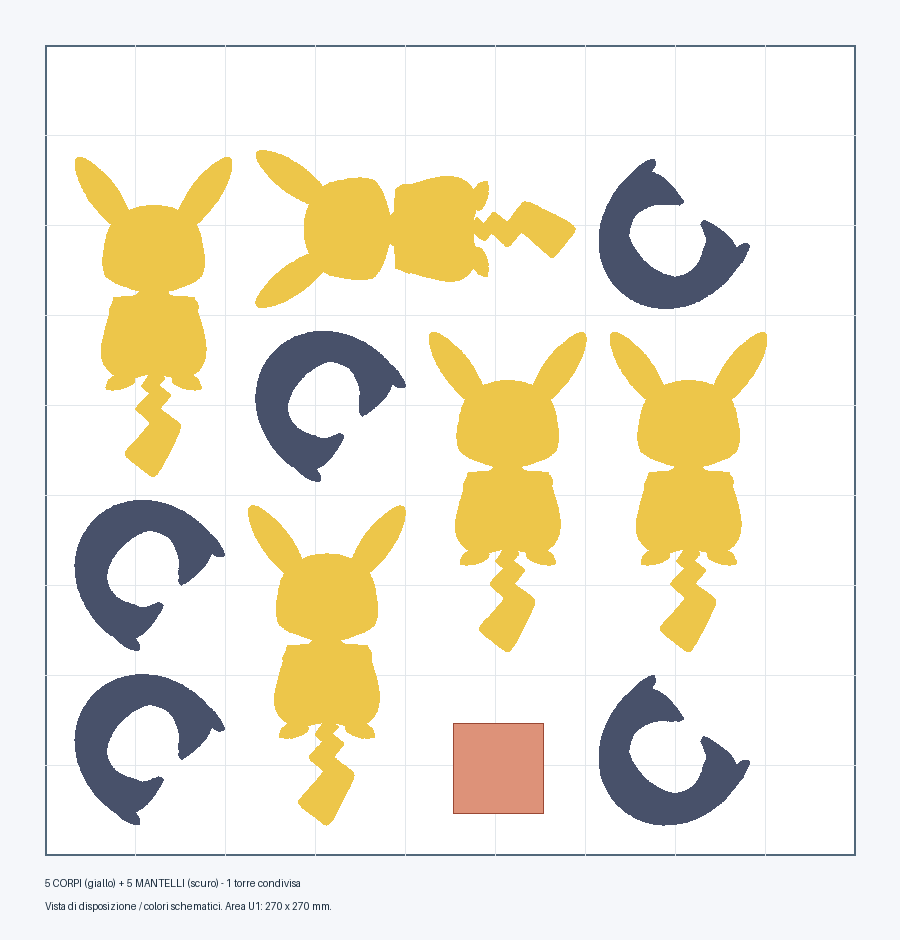

# Pika-Vamp senza portachiavi — 5 prodotti, un piatto

Aprire [PikaVamp_U1_5_COMPLETI_DETTAGLIO_008.3mf](PikaVamp_U1_5_COMPLETI_DETTAGLIO_008.3mf) **come progetto** in Snapmaker Orca e rifare lo slicing. Il piatto contiene cinque corpi articolati e cinque mantelli: cinque prodotti completi da assemblare dopo la stampa. Dimensioni originali, nessun ridimensionamento.

## Bobine sulla U1

| Testina | Colore |
|---|---|
| 1 | Giallo #FEC600 |
| 2 | Nero #161616 |
| 3 | Bianco #FFFFFF |
| 4 | Rosso scuro #C12E1F |

Una sola torre condivisa: i corpi utilizzano tutte e quattro le testine, quindi la torre resta per stabilizzare l’estrusione dopo i cambi. I mantelli usano la stessa bobina nera dei corpi. Non serve cambiare bobine fra corpo e mantello.

## Profilo dettaglio 0,08 mm

- PLA SnapSpeed; quattro ugelli 0,4 mm; PEI testurizzato; 220 °C ugelli e 65 °C piatto.
- Layer 0,08 mm, il minimo del profilo macchina; primo layer 0,16 mm.
- Pareti esterne 25 mm/s e 500 mm/s²; interne 60 mm/s e 1500 mm/s²; superfici superiori 20 mm/s e 500 mm/s².
- Tre pareti, gyroid 15%, Arachne e risoluzione 0,005 mm. Nessuna compensazione globale aggiunta che alteri gli incastri.
- Supporti ad albero: distanza verticale 0,16 mm, distanza XY 0,35 mm, interfaccia 40 mm/s. Brim automatico 4 mm con distacco 0,15 mm.
- Stampa per strato; almeno 8 mm fra gli ingombri geometrici dei componenti; percorsi entro il piatto verificati dopo lo slicing.

## Tempi e materiale stimati

| Configurazione | Totale | Tempo per prodotto | PLA per prodotto |
|---|---|---|---:|
| **Lotto da 5 — dettaglio 0,08 mm** | **36 h 20 min / 190.22 g** | **7 h 16 min** | **38.04 g** |
| Un prodotto su un piatto, stesso profilo 0,08 mm | 9 h 15 min / 50.94 g | 9 h 15 min | 50.94 g |
| Vecchia versione 0,16 mm, corpo e mantello su due piatti | 3 h 23 min / 41,85 g | 3 h 23 min | 41,85 g |

Alla stessa qualità 0,08 mm, produrre il lotto da cinque riduce la stima per prodotto del **21.5% in tempo** e del **25.3% in materiale** rispetto a stampare cinque prodotti singolarmente. Il profilo dettagliato richiede più tempo della precedente versione a 0,16 mm; il risparmio percentuale non è riferito a quella versione. Preparazione iniziale e calibrazioni possono aggiungere tempo e consumo.

## Montaggio e verifica

Rimuovere con cura supporti e brim senza forzare coda e articolazioni. Il mantello si incolla alla zona collo/testa, come previsto dall’autore. Questo progetto non utilizza magneti. Provare movimento degli snodi e montaggio prima di incollare.

Verificati integrità dei 3MF, conservazione delle mesh e dei colori, cinque istanze per componente, scala e quota Z, distanze e generazione dei percorsi di tutti e dieci i pezzi. Slicing di controllo con OrcaSlicer 2.4.2 e profilo U1 in copie temporanee con macro compatibili; il definitivo conserva le macro native Snapmaker Orca. Non è stata eseguita una stampa fisica. Cinque è il lotto disposto e verificato con questi margini; non è dichiarato un massimo matematico ottenibile con qualsiasi disposizione.

I due file precedenti e il campione singolo di confronto restano nella cartella di lavoro Verifica_PikaVamp, per tracciabilità.
