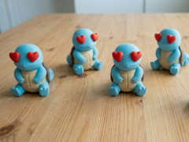

# Squirtle in Love (San Valentino) — Snapmaker U1

Progetto multicolore ottimizzato e verificato per **Snapmaker U1** con profilo **PLA SnapSpeed / Silk Dual-Color**, quattro ugelli da **0,4 mm** e **piatto PEI testurizzato**.

---

## 🧵 Mappatura Bobine e Configurazione Utente (Opzione 1: Silk Special Edition)

Per questa stampa la Snapmaker U1 sfrutta tutti e **4 gli estrusori indipendenti** caricando ciascun colore su una testina dedicata:

| Slot Stampante | Toolhead G-code | Filamento Acquistato | Codice Esadecimale | Parte del Modello |
|---|---|---|---|---|
| **Slot 1** | **T0** | **SnapSpeed PLA Pearl White** | `#E2DEDB` | Pancia / Piastrone ventrale |
| **Slot 2** | **T1** | **SnapSpeed PLA Red** | `#E72F1D` | Occhi a cuoricino |
| **Slot 3** | **T2** | **Silk Dual-Color PLA Sunset Ember** | `#D9A63A` (`#CC434F`) | Guscio posteriore (Carapace) |
| **Slot 4** | **T3** | **Silk Dual-Color PLA Ice Lake** | `#44ADE5` (`#C4C7D9`) | Corpo, testa, zampe e coda |

---

## 📊 Tabella Piatto e Tempi di Stampa

| File Progetto | Altezza Strato | Piatto | Temp. Ugelli | Temp. Piatto | Filamento Totale | Costo Stimato | Tempo Stimato | Supporti | Torre Spurgo |
|---|---:|---|---|---:|---:|---:|---:|---|---|
| [Squirtle_in_Love_U1.3mf](Squirtle_in_Love_U1.3mf) | **0,12 mm** | PEI Testurizzato | 220°C (SnapSpeed) 230°C (Silk) | 65°C | **95,60 g** | **~1,52 €** | **6h 43m** | Tree (auto) solo su piatto | Abilitata (30 mm) |

### Dettaglio Consumi per Singolo Filamento:
- **T0 — Pearl White (Pancia)**: 21,36 g (254 attivazioni)
- **T1 — Red (Cuoricini)**: 3,46 g (48 attivazioni)
- **T2 — Silk Sunset Ember (Guscio)**: 25,89 g (165 attivazioni)
- **T3 — Silk Ice Lake (Corpo)**: 44,89 g (216 attivazioni)

---

## 🔍 Parametri Tecnici e Verifiche Effettuate

1. **Altezza Strato di Alta Qualità (0,12 mm)**:
   - Come da linee guida per i modelli decorativi (`AGENTS.md`), è stato impostato uno strato di **0,12 mm** (primo strato 0,20 mm). Questo garantisce una finitura superficiale levigata e priva di gradini visibili sulla calotta sferica della testa e sui dettagli del viso.

2. **Supporti ad Albero (Tree Support)**:
   - I supporti sono configurati in modalità **Tree (auto) limitati esclusivamente al piatto di stampa (`on build plate only`)**.
   - Salgono dolcemente dal piatto per sostenere l'aggetto sotto il mento e il viso senza toccare o sporcare il corpo della tartaruga, staccandosi con estrema facilità al termine della stampa.

3. **Torre di Priming (Wipe Tower)**:
   - Abilitata con larghezza **30 mm** e brim **5 mm**, posizionata in zona sicura nella parte posteriore del piatto.
   - Sulla Snapmaker U1 con 4 estrusori indipendenti, la torre serve a stabilizzare la pressione d'estrusione e pulire la punta dell'ugello subito dopo il cambio utensile, prevenendo sbavature sulla pelle di Squirtle.

4. **Verifica Magneti**:
   - Il modello **non utilizza magneti**. Si tratta di una statuetta artistica monolitica.

---

## 🚀 Come Stampare

1. Apri **Snapmaker Orca**.
2. Trascina o apri il file [`Squirtle_in_Love_U1.3mf`](Squirtle_in_Love_U1.3mf) come **Progetto**.
3. Verifica la corrispondenza delle bobine caricate negli slot 1, 2, 3 e 4 con la tabella sopra.
4. Esegui lo slicing e invia la stampa alla stampante.
